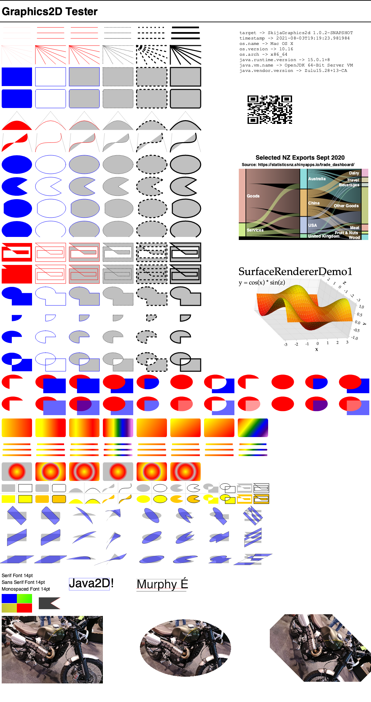

SkijaGraphics2D
===============

Version 1.0.3, 7 August 2021

Overview
--------
**SkijaGraphics2D** is an implementation of Java2D's `Graphics2D` API that targets Skia via the [Skija](https://github.com/JetBrains/skija) bindings.  The project is exploratory at the moment, but potential uses for this are:

- to provide a path for Java applications to access the Skia rendering engine, perhaps providing speed and/or quality gains compared to Java2D as well as access to target formats supported by Skia (for example, SVG and PDF)
- to include libraries such as [JFreeChart](https://github.com/jfree/jfreechart) and [Orson Charts](https://github.com/jfree/orson-charts) in [Jetpack Compose Desktop](https://www.jetbrains.com/lp/compose/) applications 
  
Note that these are **potential** uses, so far I haven't tried those things out...if you have then let me know what worked and what didn't work.

Testing
-------
**SkijaGraphics2D** is being tested using [Graphics2D Tester](https://github.com/jfree/graphics2d-tester) and produces the output shown below and now matches Java2D quite closely:



Include
-------
To include `SkijaGraphics2D` in your own project, add the following Maven dependency:

        <dependency>
            <groupId>org.jfree</groupId>
            <artifactId>org.jfree.skijagraphics2d</artifactId>
            <version>1.0.3</version>
        </dependency>

Build
-----
You can build `SkijaGraphics2D` from sources using Maven:

    mvn clean install

History
-------

##### Version 1.0.3 : 7-Aug-2021
- handle `Ellipse2D` directly in `draw(Shape)` and `fill(Shape)`
- map focus point correctly for `RadialGradientPaint`
- add default font mappings for Java logical fonts
- get font metrics from Skija (not Java2D)
- fix bug in `setColor(Color)` method where Skija paint not set
- fix clipping issues 

##### Version 1.0.2 : 4-Aug-2021
- fix `setClip()` to restore original clip before applying new user clip
- set `PathFillMode` when filling paths
- add `MIN_LINE_WIDTH` to apply for `BasicStroke(0f)`
- fix exception when `Rectangle2D` has negative `width` or `height`

##### Version 1.0.1 : 27-Jul-2021
- added specialisation in `fill(Shape)` for `Rectangle2D` instances
- added caching of `Typeface` instances
- fix paint setting for font rendering
- added support for `AlphaComposite`
- apply clipping (still work-in-progress)
- fix for cyclic gradient paint
- updated `Skija` to version 0.92.18
- added logging via `SLF4J` and `Log4J2`

##### Version 1.0.0 : 21-Jul-2021
- initial public release.

License
-------

`SkijaGraphics2D` is licensed under a BSD-style license:

```
Copyright (c) 2021, by David Gilbert.

All rights reserved.

Redistribution and use in source and binary forms, with or without modification, 
are permitted provided that the following conditions are met:

1. Redistributions of source code must retain the above copyright notice, this
list of conditions and the following disclaimer.

2. Redistributions in binary form must reproduce the above copyright notice, 
this list of conditions and the following disclaimer in the documentation 
and/or other materials provided with the distribution.

3. Neither the name of the copyright holder nor the names of its contributors 
may be used to endorse or promote products derived from this software without 
specific prior written permission.

THIS SOFTWARE IS PROVIDED BY THE COPYRIGHT HOLDERS AND CONTRIBUTORS "AS IS" 
AND ANY EXPRESS OR IMPLIED WARRANTIES, INCLUDING, BUT NOT LIMITED TO, THE 
IMPLIED WARRANTIES OF MERCHANTABILITY AND FITNESS FOR A PARTICULAR PURPOSE ARE 
DISCLAIMED. IN NO EVENT SHALL THE COPYRIGHT HOLDER OR CONTRIBUTORS BE LIABLE FOR
ANY DIRECT, INDIRECT, INCIDENTAL, SPECIAL, EXEMPLARY, OR CONSEQUENTIAL DAMAGES 
(INCLUDING, BUT NOT LIMITED TO, PROCUREMENT OF SUBSTITUTE GOODS OR SERVICES; 
LOSS OF USE, DATA, OR PROFITS; OR BUSINESS INTERRUPTION) HOWEVER CAUSED AND ON 
ANY THEORY OF LIABILITY, WHETHER IN CONTRACT, STRICT LIABILITY, OR TORT 
(INCLUDING NEGLIGENCE OR OTHERWISE) ARISING IN ANY WAY OUT OF THE USE OF THIS 
SOFTWARE, EVEN IF ADVISED OF THE POSSIBILITY OF SUCH DAMAGE.
```
